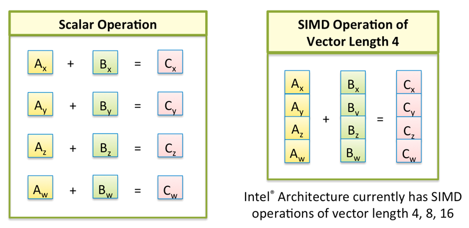
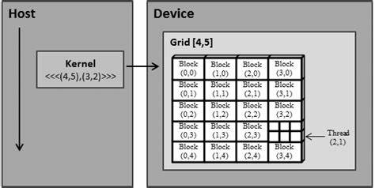

# 1 稳定性

考虑以下初值问题，

```math
\left\{
    \begin{aligned}
        &\frac{du}{dt}+Au=0,\quad 0\le t \le T, \\
        &u(0) = b.
    \end{aligned}
\right.
```

其中，$`A`$、$`T`$、$`b`$都是常数。

使用有限差分来求解它，把时间导数用一阶差商替换，得到差分格式（一阶前向差分），

```math
\begin{aligned}
&\frac{u_{n+1}-u_{n}}{\Delta t} + Au_{n} = 0, \\
&u_0 = b.
\end{aligned}
```

这个算法只在$`\Delta t \le 2/A`$时才是**稳定的（stable）**，如果不满足这个条件，数值解会随时间增加发散到无穷大。

令$`A=4`$，那么必须要有$`\Delta t \le 1/2`$。从代码运行结果可以看到，第一批结果是正常的，第二批结果完全发散了。下面一段代码演示了这一点。

> 编译代码
>
> 首先把代码保存到文件中，名为`initial-value.cxx`。
>
> 然后使用`g++`编译，生成一个名为`initial-value`的可执行文件。
>
> `g++ initial-value.cxx -o initial-value`

```c++
// file: ode/initial-value.cxx
//
// Initial value problem
//
// ddt(u) + Au = 0,  0 <= t <= T
// u(0) = b
//
// Scheme:
// u_{n+1} - u_{n} + dt*A*u_{n} = 0

#include <vector>
#include <cstdio>

int main() {

    double A = 4;   // coefficient
    double b = 0.5; // boundary condition
    double T = 10;  // upper limit
    double dt;      // time step
    double u;       // value

    dt = 0.4;
    u = b;
    printf("A = %f, dt = %f, stable? %d\n", A, dt, dt <= 2 / A);
    for (double t = 0; t < T; t += dt) {
        printf("t = %f, u = %f\n", t, u);
        u = u - dt * A * u;
    }

    printf("\n");

    dt = 0.6;
    u = b;
    printf("A = %f, dt = %f, stable? %d\n", A, dt, dt <= 2 / A);
    for (double t = 0; t < T; t += dt) {
        printf("t = %f, u = %f\n", t, u);
        u = u - dt * A * u;
    }

    return 0;
}
```

或者用下面的 Python 代码。

> 新建一个`initial-value.py`文件保存代码。
>
> 运行代码：
>
> `python3 initial-value.py`

```python
# file: ode/initial-value.py
#
# Initial value problem
#
# ddt(u) + Au = 0,  0 <= t <= T
# u(0) = b
#
# Scheme:
# u_{n+1} - u_{n} + dt*A*u_{n} = 0
import numpy as np

A = 4       # coefficient
b = 0.5     # boundary condition
T = 10      # upper limit

dt = 0.4    # time step
u = b
print(f"A = {A}, dt = {dt}, stable? {dt<=2/A}")
for t in np.arange(0, T, dt):
    print(f"t = {t:.3}, u = {u:.5f}")
    u = u - dt*A*u

print();

dt = 0.6
u = b
print(f"A = {A}, dt = {dt}, stable? {dt<=2/A}")
for t in np.arange(0, T, dt):
    print(f"t = {t:.3}, u = {u:.5f}")
    u = u - dt*A*u
```

# 2 程序性能

考虑一个矩阵乘法，

```math
C=A*B
```

其中的三个矩阵都是$`N\times N`$。

简单的矩阵乘法就是按定义实现，
```c++
for (i = 0; i < N; i++)
    for (j = 0; j < N; j++)
        for (k = 0; k < N; k++)
            C[i][j] += A[i][k] * B[k][j];
```

做一次矩阵乘法一共有$`N^3`$次迭代。下面的代码演示的是，仅仅改变循环嵌套的顺序，就可以让计算时间发生巨大变化。

> 编译代码
>
> 新建文件`mm.cxx`保存下面的代码并编译，生成一个名为`mm`的可执行文件。
>
> `g++ mm.cxx -o mm`

```c++
// file: perf/mm.cxx
#include <cstdio>
#include <ctime>

// i for rows, j for columns
#define C(i, j) C[i + N * j]
#define A(i, j) A[i + N * j]
#define B(i, j) B[i + N * j]

int main() {

    clock_t clocks;

    int N = 1000;
    auto A = new double[N * N];
    auto B = new double[N * N];
    auto C = new double[N * N];

    int i, j, k;

    // Loop nest: IJK
    clocks = clock();
    for (i = 0; i < N; i++)
        for (j = 0; j < N; j++)
            for (k = 0; k < N; k++)
                C(i, j) += A(i, k) * B(k, j);

    clocks = clock() - clocks; // timing

    printf("IJK, N = %d, Execution time = %ld ms\n", N, clocks * 1000 / CLOCKS_PER_SEC);

    // Loop nest: IKJ
    clocks = clock();
    for (i = 0; i < N; i++)
        for (k = 0; k < N; k++)
            for (j = 0; j < N; j++)
                C(i, j) += A(i, k) * B(k, j);

    clocks = clock() - clocks; // timing

    printf("IKJ, N = %d, Execution time = %ld ms\n", N, clocks * 1000 / CLOCKS_PER_SEC);

    // Loop nest: JKI
    clocks = clock();
    for (j = 0; j < N; j++)
        for (k = 0; k < N; k++)
            for (i = 0; i < N; i++)
                C(i, j) += A(i, k) * B(k, j);

    clocks = clock() - clocks; // timing

    printf("JKI, N = %d, Execution time = %ld ms\n", N, clocks * 1000 / CLOCKS_PER_SEC);

    // cleanup
    delete[] A;
    delete[] B;
    delete[] C;

    return 0;
}
```

# 3 并行计算

## 向量化

并行计算有很多种，其中一种简单的形式是**向量化（vectorization）**，也就是让一个处理器同时做多个标量运算。

例如，把两个长度为$`N`$的向量相加，下面的代码看起来需要$`N`$次运算。

```c++
for (int i = 0; i < N; i++)
    c[i] = a[i] + b[i];
```

实际上，经过向量化之后（vectorized），有可能只需要$`N/4`$次运算或者更少，每次运算都是把多个数字当成一个很短的向量一起算。



仍然用前面的矩阵乘法代码`mm.cxx`，不过在编译时我们启用向量化功能。执行代码，可以看到执行时间变短。

```bash
g++ -O3 -fopt-info-vec mm.cxx -o vec_mm
```

> 这里的`-fopt-info-vec`是让编译器打印一条消息，告诉我们有没有成功向量化。

## 多线程

另一种并行的技术是**多线程（multithreading）**，利用多核处理器做并行计算。前面都是利用一个处理器，现在我们要利用多个处理器，因此可以计算更大的矩阵。

例如，下面的代码让 4 个线程同时计算$`N=2000`$的情况。如果用前面的`mm.cxx`来算，时间会很长，但使用多线程之后，会明显变快。

> 编译代码
>
> 先把代码拷贝到文件`par_mm.cxx`中。
>
> 这里使用了 OpenMP 为我们生成多线程的代码，编译时使用下面的命令。
>
> `g++ -fopenmp par_mm.cxx -o par_mm`

```c++
// file: par_mm.cxx
#include <omp.h>
#include <cstdio>
#include <ctime>

// i for rows, j for columns
#define C(i, j) C[i + N * j]
#define A(i, j) A[i + N * j]
#define B(i, j) B[i + N * j]

int main() {

    clock_t clocks;

    int N = 4000;
    auto A = new double[N * N];
    auto B = new double[N * N];
    auto C = new double[N * N];
    int strip = 8;

    // Set the number of threads
    int nthreads = 4;
    omp_set_num_threads(nthreads);

    // Loop nest: JKI
    clocks = clock();
#pragma omp parallel for
    for (int j = 0; j < N; j++)
        for (int k = 0; k < N; k++)
            for (int i = 0; i < N; i++)
                C(i, j) += A(i, k) * B(k, j);

    clocks = clock() - clocks; // timing

    printf("[%d threads] JKI, N = %d, Execution time = %ld ms\n",
           nthreads, N, clocks * 1000 / CLOCKS_PER_SEC / nthreads);

    // cleanup
    delete[] A;
    delete[] B;
    delete[] C;

    return 0;
}
```

## 多线程+向量化

多线程通常可以把外层循环并行，向量化通常可以把内层循环并行，这两个可以合起来使用。只要加上两个选项就行。

```bash
g++ -fopenmp -O3 par_mm.cxx -o par_vec_mm
```

## SIMT

前面的多线程、向量化都是利用 CPU，我们还可以利用 GPU。使用 GPU 做通用计算的方式有很多，其中有两种是我们常用的：CUDA, HIP。

这两种方式都采用了称为 **SIMT（single instruction multiple threads）** 的模型。下面介绍一下，如何把前面的矩阵乘法变成能在 GPU 上执行的算法。

### 步骤1：Tiling

我们把矩阵乘法的三层循环变换一下，变成某种形式的分块乘法（**tiling**）。

原本的循环如下。

```c++
for (int j = 0; j < N; j++)
    for (int k = 0; k < N; k++)
        for (int i = 0; i < N; i++)
            C(i, j) += A(i, k) * B(k, j);
```

我们把矩阵$`C`$的计算分成一块一块进行，每一块的大小为$`16\times 16`$。这个变换是由两个步骤组成的：

- Strip-mining: 把单层循环$`i`$变成跨步为$`16`$的双层循环，循环$`j`$同理；
- Loop interchange: 把两个有跨步的循环交换到最外层。

```c++
int nblock_x = 16;
int nblock_y = 16;

for (int jj = 0; jj < N; jj += nblock_y)
    for (int ii = 0; ii < N; ii += nblock_x)
        for (int j = jj; j < jj + nblock_y && j < N; j++)
            for (int i = ii; i < ii + nblock_x && i < N; i++)
                for (int k = 0; k < N; k++)
                    C(i, j) += A(i, k) * B(k, j);
```

### 步骤2：Kernel

有了 tiling 代码，就可以用 HIP/CUDA 的语法替换掉 tiling 里面的循环。使用 HIP/CUDA 时，我们通常要指明 3 个参数：

- 有多少个 blocks？
- 每个 block 有多少个 threads？
- 每个 thread 做什么？



在这里，我们不研究具体的细节，只做演示。首先，tiling 代码中的最内层循环是一个 thread 要做的事情，我们把它提出来，按照 HIP/CUDA 的语法写成所谓的 **kernel**。

原代码：

```c++
for (int k = 0; k < N; k++)
    C(i, j) += A(i, k) * B(k, j);
```

新代码：

```c++
__global__ void mmKernel(double *C, double *A, double *B, int N) {
    int i = threadIdx.x + blockDim.x * blockIdx.x;
    int j = threadIdx.y + blockDim.y * blockIdx.y;

    for (int k = 0; k < N; k++)
        C(i, j) += A(i, k) * B(k, j);
}
```

然后，tiling 代码中间两层循环$`i,j`$遍历一个大小为$`B_x\times B_y`$的小块，我们把它们去掉，换成 HIP/CUDA 的语法，只需要说明块有多大即可。

原代码：

```c++
int nblock_x = 16;
int nblock_y = 16;

for (int j = jj; j < jj + nblock_y && j < N; j++)
    for (int i = ii; i < ii + nblock_x && i < N; i++)
```

新代码：

```c++
dim3 block(16, 16);     // inner loops i,j
```

接着，tiling 代码最外面两层循环$`ii,jj`$决定了有多少个小块，我们把它们去掉，换成 HIP/CUDA 的语法，只需要说明有多少个块即可。

原代码：

```c++
for (int jj = 0; jj < N; jj += nblock_y)
  for (int ii = 0; ii < N; ii += nblock_x)
```

新代码：

```c++
dim3 grid((N + block.x - 1) / block.x, // outer loops ii,jj
          (N + block.y - 1) / block.y);
```

## 步骤3：启动 Kernel

最后，我们把前面的块数量、块大小、函数全部用起来，就能够完全替换掉原本的 5 层循环。

原代码的循环：

```c++
  // Parameters for tiling
  int nblock_x = 16;
  int nblock_y = 16;

  for (int jj = 0; jj < N; jj += nblock_y)
    for (int ii = 0; ii < N; ii += nblock_x)
      for (int j = jj; j < jj + nblock_y && j < N; j++)
        for (int i = ii; i < ii + nblock_x && i < N; i++)
          for (int k = 0; k < N; k++)
            C(i, j) += A(i, k) * B(k, j);
```

新代码：

```c++
// Innermost loop k
__global__ void mmKernel(double *C, double *A, double *B, int N) {
  int i = threadIdx.x + blockDim.x * blockIdx.x;
  int j = threadIdx.y + blockDim.y * blockIdx.y;

  for (int k = 0; k < N; k++)
    C(i, j) += A(i, k) * B(k, j);
}

dim3 block(16, 16);                     // inner loops i,j
dim3 grid((N + block.x - 1) / block.x,  // outer loops ii,jj
          (N + block.y - 1) / block.y);

mmKernel<<<grid, block>>>(C, A, B, N);
```

> 编译运行
> 
> Tiling 的代码见 git 仓库`perf/tiled_mm.cxx`。
> 
> 变换后的 HIP 代码见`perf/simt_mm.cxx`
> 
> HIP 代码需要在有 GPU 的机器上编译、执行，编译的命令为
> 
> `hipcc simt_mm.cxx -o simt_mm`